# Apprendre à aimer Git en ligne de commande

<br>

Les commandes, options et réglages méconnus<br>mais très utiles au quotidien

<!--
Intro : qui utilise git en CLI ? Qui utilise uniquement l'interface graphique ?
L'objectif aujourd'hui c'est de vous donner des outils concrets pour aller plus vite.
-->

---
---

<div class="flex items-center gap-8 h-full">
  
  <div>
    <h1>Alexis Wurth</h1>
    <p>Développeur PHP/Symfony</p>
    <p class="flex items-center gap-2"><a href="https://github.com/awurth">awurth</a></p>
  </div>
</div>


---
layout: default
---

# Au programme

<v-clicks>

- **<Link to="changements">Regarder ses changements</Link>** <span class="text-sm text-gray-400">— diff, delta, color-moved</span>
- **<Link to="naviguer">Naviguer</Link>** <span class="text-sm text-gray-400">— switch/restore, branch -v</span>
- **<Link to="stash">Mettre de côté</Link>** <span class="text-sm text-gray-400">— stash</span>
- **<Link to="commit">Préparer le commit</Link>** <span class="text-sm text-gray-400">— add -p, add -N</span>
- **<Link to="historique">Réécrire l'historique</Link>** <span class="text-sm text-gray-400">— rebase -i, autoStash, update-refs</span>
- **<Link to="pousser">Pousser</Link>** <span class="text-sm text-gray-400">— force-with-lease</span>
- **<Link to="conflits">Conflits</Link>** <span class="text-sm text-gray-400">— zdiff3, rerere</span>
- **<Link to="config">Configurer son environnement</Link>** <span class="text-sm text-gray-400">— includeIf, fetch.prune</span>

</v-clicks>

---
layout: section
routeAlias: changements
---

# Regarder ses changements


---
layout: default
---

# `status.showUntrackedFiles`

```bash
$ git status
Untracked files:
  src/   # ← on ne voit pas ce qu'il y a dedans
```

<br>

<v-click>

```bash
git config --global status.showUntrackedFiles all
```

</v-click>

<v-click>

```bash
$ git status
Untracked files:
  src/Controller/UserController.php
  src/Repository/UserRepository.php
  src/Entity/User.php
```

</v-click>

---
layout: two-cols
---

<div class="h-full flex items-center justify-center">

# `git diff`

</div>

::right::

<div class="relative h-full">
  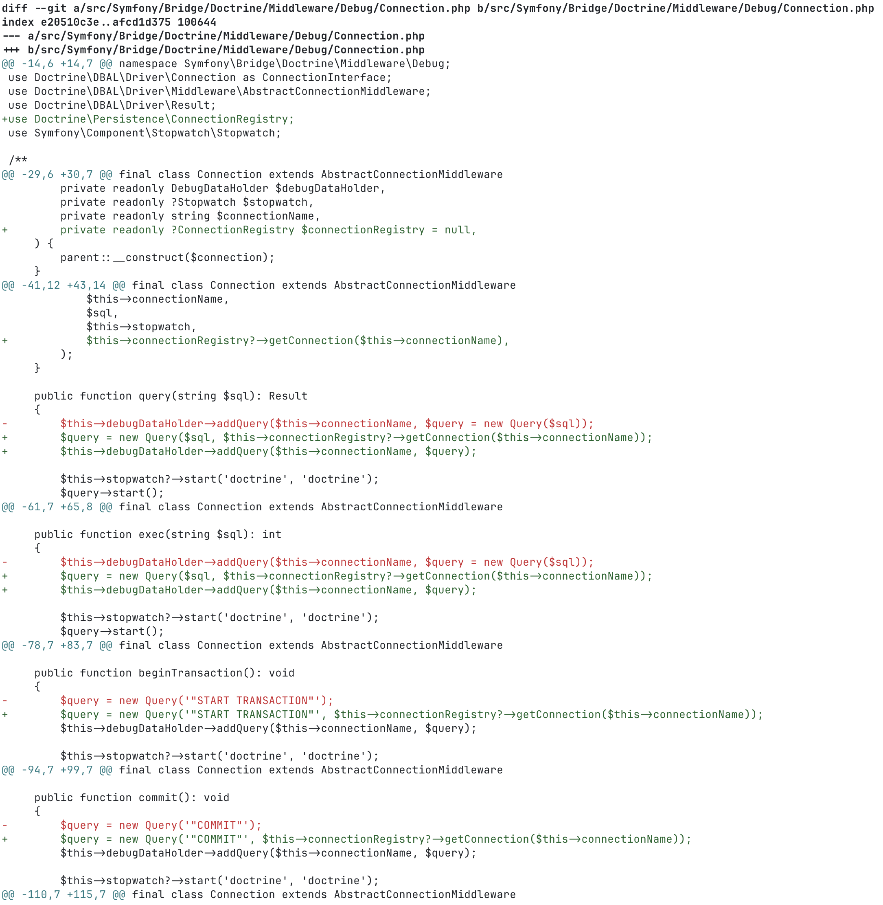
  <div v-click class="absolute inset-0 flex items-center justify-center">
    <div class="text-9xl">💩</div>
  </div>
</div>

---

# diff-so-fancy

```bash
# Installation
npm install -g diff-so-fancy

# Configuration
git config --global core.pager "diff-so-fancy | less --tabs=4 -RFX"
git config --global interactive.diffFilter "diff-so-fancy --patch"
```

<br>

- En-têtes de fichiers mis en valeur
- `+`/`-` remplacés par des blocs colorés
- Surlignage des changements

---
layout: image
image: /diff-so-fancy.png
backgroundSize: contain
---

---

# delta

```bash
# Installation
brew install git-delta

# Configuration
git config --global core.pager delta
git config --global interactive.diffFilter "delta --color-only"
```

<br>

- Coloration syntaxique
- Thèmes personnalisés
- Mode light/dark automatique
- Affichage "side-by-side"
- Numéros de lignes

<!--
Montrer une capture d'écran ou une démo si possible. L'impact visuel est immédiat.
delta : https://github.com/dandavison/delta
-->

---
layout: image
image: /delta.png
backgroundSize: contain
---

<!--
diff-so-fancy : https://github.com/so-fancy/diff-so-fancy

En préparant ces slides j'ai découvert un concurrent : hunk (https://github.com/modem-dev/hunk) qui se prétend meilleur que les deux. Pas testé.
-->

---
layout: default
---

# `diff.colorMoved`

<br>

```bash
git config --global diff.colorMoved default
git config --global diff.colorMovedWS allow-indentation-change # ou ignore-all-space
```

<br>

<v-click>

<div class="flex gap-4 mt-4">
  <div class="flex-1 text-center">
    <div class="text-sm text-gray-500 mb-1">Sans <code>diff.colorMoved</code></div>
    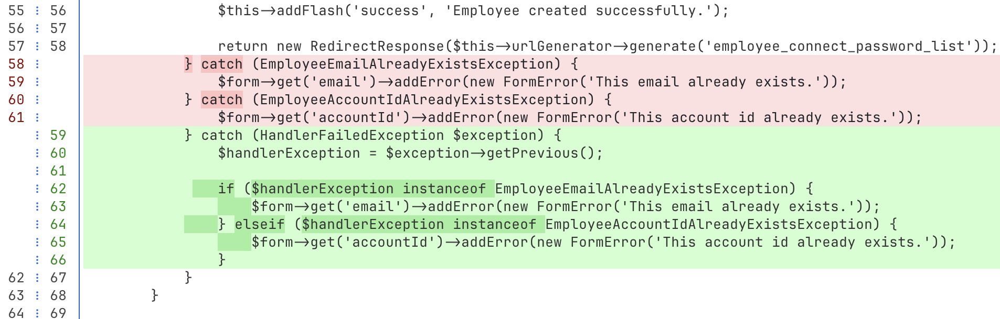
  </div>
  <div class="flex-1 text-center">
    <div class="text-sm text-gray-500 mb-1">Avec <code>diff.colorMoved</code></div>
    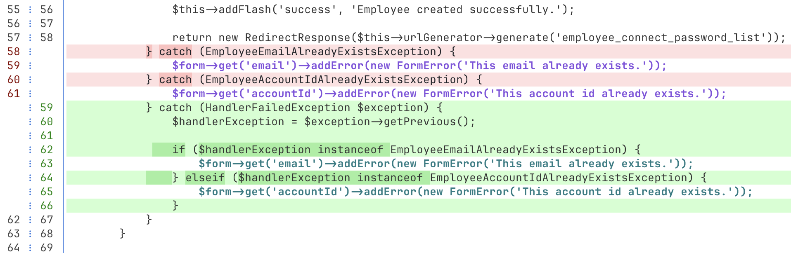
  </div>
</div>

</v-click>

<!--
color-moved : disponible depuis git 2.15 (2017). Beaucoup de devs ne savent pas que ça existe.
diff.colorMoved peut valoir : no, default, blocks, zebra, dimmed-zebra
-w / --ignore-all-space : utile ponctuellement pour ignorer le bruit d'indentation.
-->

---
layout: default
disabled: true
---

# `git log` — options essentielles

```bash
# Compact + graphe de branches
git log --oneline --graph --decorate

# Limiter / filtrer
git log -10
git log --since="2 weeks ago"
git log --author="Alexis"
git log -- src/Controller/
```

<v-click>

```bash
# Voir les modifications
git log -p          # avec le diff complet
git log --stat      # fichiers modifiés + stats

# Chercher dans les messages
git log --grep="fix"

# Chercher dans le contenu des commits
git log -S "password"        # commits où "password" apparaît/disparaît
git log -G "password.*hash"  # commits dont le diff matche la regex
```

</v-click>

<!--
--stat : vue rapide de l'ampleur d'un commit. Très utile en code review.
--format : pratique pour générer des changelogs ou rapports.
-S (pickaxe) : cherche les commits qui ont ajouté ou supprimé la chaîne exacte — idéal pour retrouver quand une fonction a été introduite ou supprimée.
-G : comme -S mais avec une regex sur le contenu du diff — plus puissant, légèrement plus lent.
Les deux peuvent être lents sur un gros dépôt : limiter avec --since, -n ou -- path/ pour réduire le scope.
-L :début,fin:fichier — suit l'historique d'une plage de lignes ou d'une fonction précise. Ex: git log -L :maFonction:src/Foo.php
--follow : suit l'historique d'un fichier à travers les renommages. Ex: git log --follow src/Foo.php
-->

---
layout: section
routeAlias: naviguer
---

# Naviguer

Se déplacer dans le dépôt

---
layout: two-cols-header
---

# `switch` et `restore`

::left::

**Navigation de branches**

```bash
# Changer de branche
git checkout main

# Créer et changer de branche
git checkout -b feature/foo
```

**Restauration de fichiers**

```bash
# Restaurer un fichier
git checkout -- src/foo.php

# Restaurer depuis un commit
git checkout abc123 -- src/foo.php
```

::right::

<v-click>

**Navigation de branches**

```bash
# Changer de branche
git switch main

# Créer et changer de branche
git switch -c feature/foo
```

</v-click>

<v-click>

**Restauration de fichiers**

```bash
# Restaurer un fichier (working tree)
git restore src/foo.php

# Restaurer depuis un commit
git restore --source=abc123 src/foo.php

# Désindexer
git restore --staged src/foo.php
```

</v-click>

---
layout: default
---

# `-` : branche précédente

<br>

<v-click>

**`git switch -`**

````md magic-move
```bash
# Sur feature/foo — bug signalé sur fix/bug-123
git switch fix/bug-123
```

```bash
# Sur feature/foo — bug signalé sur fix/bug-123
git switch fix/bug-123
# ... correction ...
```

```bash
# Sur feature/foo — bug signalé sur fix/bug-123
git switch fix/bug-123
# ... correction ...
git switch -          # retour sur feature/foo
```
````

</v-click>

<v-click>

**`git rebase -`**

````md magic-move
```bash
# Sur feature/foo — besoin de synchro avec main
git switch main
```

```bash
# Sur feature/foo — besoin de synchro avec main
git switch main
git pull
```

```bash
# Sur feature/foo — besoin de synchro avec main
git switch main
git pull
git switch -          # retour sur feature/foo
```

```bash
# Sur feature/foo — besoin de synchro avec main
git switch main
git pull
git switch -          # retour sur feature/foo
git rebase -          # rebase sur main
```
````

</v-click>

<v-click>

> Fonctionne avec `switch`, `checkout`, `merge`, `rebase`

</v-click>

---
layout: default
---

# `git branch -v`

<br>

````md magic-move
```bash
git branch
#   feature/auth
#   feature/search
# * main
#   hotfix/login
#   old-feature
```

```bash
git branch -v
#   feature/auth   a3f2e1c Add JWT middleware
#   feature/search 8b4d2f0 WIP: elastic integration
# * main           c1e9a4b Merge pull request #42
#   hotfix/login   f2a1c3d Fix session timeout
#   old-feature    f2a1c3d [gone] WIP
```

```bash
git branch -vv
#   feature/auth   a3f2e1c [origin/feature/auth] Add JWT middleware
#   feature/search 8b4d2f0 [origin/feature/search: ahead 2] WIP: elastic integration
# * main           c1e9a4b [origin/main: behind 3] Merge pull request #42
#   hotfix/login   f2a1c3d [origin/hotfix/login] Fix session timeout
#   old-feature    f2a1c3d [origin/old-feature: gone] WIP
```
````

<br>

<v-click>

```bash
# Trier par date de dernier commit
git config --global branch.sort -committerdate
```

</v-click>

<!--
branch -vv révèle aussi les branches qui ont divergé du remote. Très utile en équipe.
-->

---
layout: default
---

# `fetch.prune` — Rester en sync avec le remote

<br>

```bash
git fetch --prune
git branch -v
#   old-feature  f2a1c3d [gone] WIP
```

<br>

<v-click>

```bash
# Supprimer toutes les branches locales dont le remote est gone
git branch -v | grep -F '[gone]' | cut -f 3 -d ' ' | xargs git branch -D
```

</v-click>

<br>

<v-click>

```bash
# En config, pour ne plus avoir à penser à --prune
git config --global fetch.prune true
```

</v-click>

---
layout: section
routeAlias: stash
---

# Mettre de côté

Changer de contexte sans perdre son travail

---
layout: default
---

# `git stash` — push et pop

<br>

```bash
$ git stash push

$ git stash list
stash@{0}: WIP on main: abc1234 fix login
```

<v-click>

<div class="text-center text-3xl my-2">↓</div>

```bash
# -u : inclut aussi les fichiers non-trackés
$ git stash push -u -m "wip: nouvelle feature"

$ git stash list
stash@{0}: On main: wip: nouvelle feature
```

</v-click>

<br>

<v-click>

```bash
# Restaurer aussi l'état staged/unstaged (sinon perdu au pop/apply)
git config --global stash.index true
```

</v-click>

---
layout: section
routeAlias: commit
---

# Préparer un commit

Choisir exactement ce qui part dans le commit

---
layout: default
---

# `git add -p` — mode patch

Sélectionner les hunks (gros morceaux) à indexer un par un.

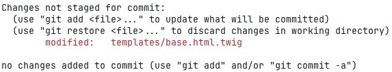

<v-click>

```bash
git add -p
```

</v-click>

<v-click>

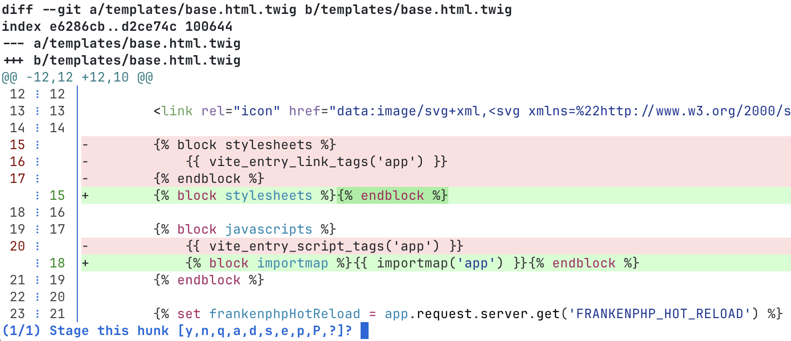

</v-click>

<!--
> 💡 `-p` fonctionne aussi avec `restore`, `stash`, `reset`, `commit`
-->

---
layout: default
---

# `git add -p` — aide interactive

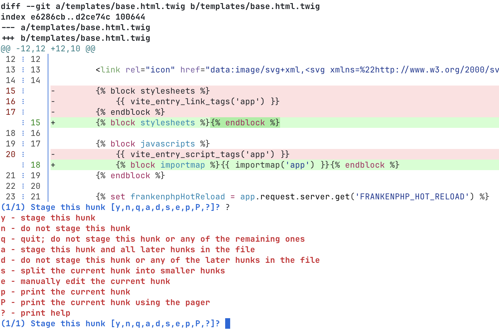

---
layout: default
---

# `git add -p` — découper un hunk

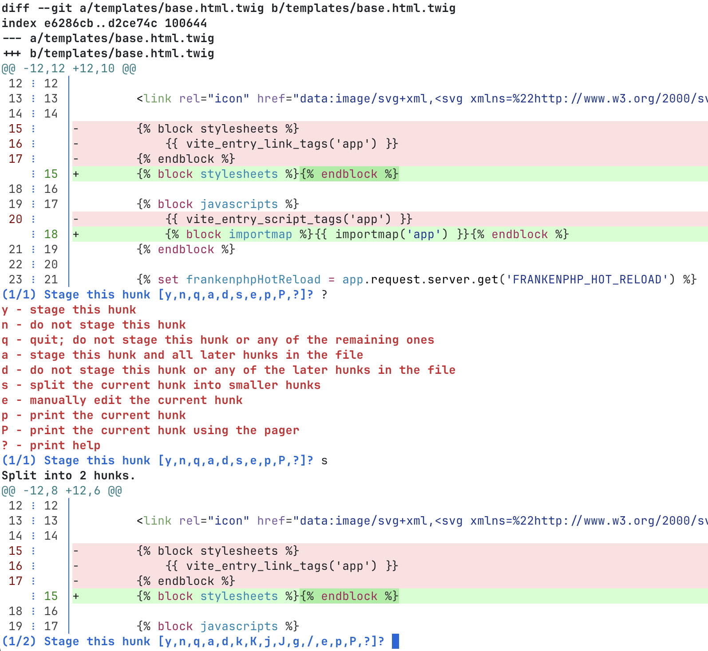

---
layout: default
---

# `git add -p` — éditer un hunk manuellement

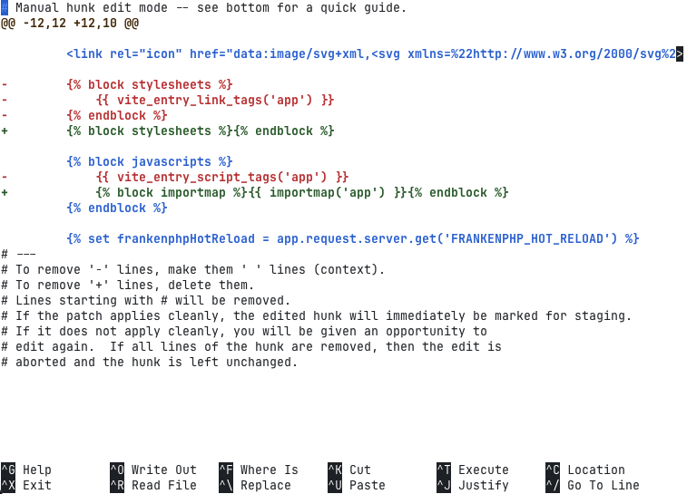

---
layout: default
---

# `git add -p` — résultat

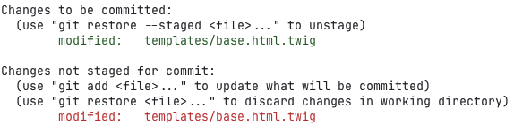

> 💡 `-p` fonctionne aussi avec `restore`, `stash`, `reset`, `commit`

---
layout: default
---

# `git add -N` — intention d'ajouter

<br>

```bash
$ git status
Untracked files:
  src/Controller/UserController.php

git diff              # → rien
```

<br>

<v-click>

```bash
git add -N src/Controller/UserController.php
git diff              # → montre le fichier entier comme ajout
```

</v-click>

<br>

<v-click>

```bash
git add -N .          # marquer tous les nouveaux fichiers
git add -p            # indexer sélectivement
```

</v-click>

---
layout: default
disabled: true
---

# `commit.verbose` — voir le diff dans l'éditeur

```bash
git config --global commit.verbose true
# ou
git commit -v
```

<v-click>

<div class="flex gap-4 mt-4">
  <div class="flex-1 text-center">
    <div class="text-sm text-gray-500 mb-1">Sans <code>-v</code></div>
    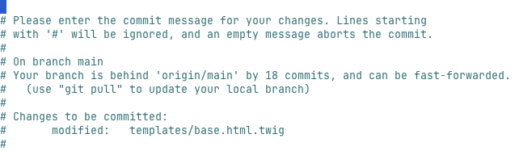
  </div>
  <div class="flex-1 text-center">
    <div class="text-sm text-gray-500 mb-1">Avec <code>-v</code></div>
    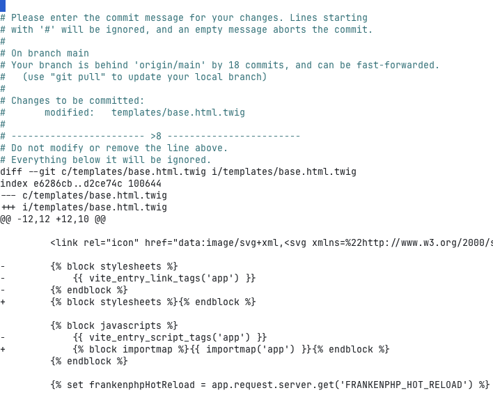
  </div>
</div>

</v-click>

---
layout: section
routeAlias: historique
---

# Réécrire l'historique

rebase -i, autoStash, update-refs

---
layout: default
---

# Rebase interactif

<br>

````md magic-move
```bash {*|2-5}
$ git log --oneline
d4e5f6g (HEAD -> feature/login) Ajouter les tests
c3d4e5f fix typo
b2c3d4e WIP
a1b2c3d Ajouter le formulaire de connexion
9f9152a (main) Mettre à jour la doc
7e2d3c1 Corriger la pagination
3a8b4f0 Ajouter le module de paiement
```
```bash {2-5,10}
$ git log --oneline
d4e5f6g (HEAD -> feature/login) Ajouter les tests
c3d4e5f fix typo
b2c3d4e WIP
a1b2c3d Ajouter le formulaire de connexion
9f9152a (main) Mettre à jour la doc
7e2d3c1 Corriger la pagination
3a8b4f0 Ajouter le module de paiement

$ git rebase -i HEAD~4
```
```bash
$ git rebase -i HEAD~4
# → dans l'éditeur :

pick a1b2c3d Ajouter le formulaire de connexion
pick b2c3d4e WIP
pick c3d4e5f fix typo
pick d4e5f6g Ajouter les tests

# Commands:
# p, pick <commit> = use commit
# r, reword <commit> = use commit, but edit the commit message
# s, squash <commit> = use commit, but meld into previous commit
# f, fixup [-C | -c] <commit> = like "squash" but keep only the previous
#                    commit's log message, unless -C is used, in which case
#                    keep only this commit's message; -c is same as -C but
#                    opens the editor
# d, drop <commit> = remove commit
```
```bash {4}
$ git rebase -i HEAD~4
# → dans l'éditeur :

reword a1b2c3d Ajouter le formulaire de connexion
pick b2c3d4e WIP
pick c3d4e5f fix typo
pick d4e5f6g Ajouter les tests

# Commands:
# p, pick <commit> = use commit
# r, reword <commit> = use commit, but edit the commit message
# s, squash <commit> = use commit, but meld into previous commit
# f, fixup [-C | -c] <commit> = like "squash" but keep only the previous
#                    commit's log message, unless -C is used, in which case
#                    keep only this commit's message; -c is same as -C but
#                    opens the editor
# d, drop <commit> = remove commit
```
```bash {6}
$ git rebase -i HEAD~4
# → dans l'éditeur :

pick a1b2c3d Ajouter le formulaire de connexion
pick b2c3d4e WIP
drop c3d4e5f fix typo
pick d4e5f6g Ajouter les tests

# Commands:
# p, pick <commit> = use commit
# r, reword <commit> = use commit, but edit the commit message
# s, squash <commit> = use commit, but meld into previous commit
# f, fixup [-C | -c] <commit> = like "squash" but keep only the previous
#                    commit's log message, unless -C is used, in which case
#                    keep only this commit's message; -c is same as -C but
#                    opens the editor
# d, drop <commit> = remove commit
```
```bash {4-6}
$ git rebase -i HEAD~4
# → dans l'éditeur :

pick a1b2c3d Ajouter le formulaire de connexion
pick b2c3d4e WIP
pick d4e5f6g Ajouter les tests

# Commands:
# p, pick <commit> = use commit
# r, reword <commit> = use commit, but edit the commit message
# s, squash <commit> = use commit, but meld into previous commit
# f, fixup [-C | -c] <commit> = like "squash" but keep only the previous
#                    commit's log message, unless -C is used, in which case
#                    keep only this commit's message; -c is same as -C but
#                    opens the editor
# d, drop <commit> = remove commit
```
```bash
$ git rebase -i HEAD~4
# → dans l'éditeur :

pick a1b2c3d Ajouter le formulaire de connexion
pick b2c3d4e WIP
pick c3d4e5f fix typo
pick d4e5f6g Ajouter les tests

# Commands:
# p, pick <commit> = use commit
# r, reword <commit> = use commit, but edit the commit message
# s, squash <commit> = use commit, but meld into previous commit
# f, fixup [-C | -c] <commit> = like "squash" but keep only the previous
#                    commit's log message, unless -C is used, in which case
#                    keep only this commit's message; -c is same as -C but
#                    opens the editor
# d, drop <commit> = remove commit
```
```bash {4-6}
$ git rebase -i HEAD~4
# → dans l'éditeur :

pick a1b2c3d Ajouter le formulaire de connexion
pick b2c3d4e WIP
pick c3d4e5f fix typo
pick d4e5f6g Ajouter les tests

# Commands:
# p, pick <commit> = use commit
# r, reword <commit> = use commit, but edit the commit message
# s, squash <commit> = use commit, but meld into previous commit
# f, fixup [-C | -c] <commit> = like "squash" but keep only the previous
#                    commit's log message, unless -C is used, in which case
#                    keep only this commit's message; -c is same as -C but
#                    opens the editor
# d, drop <commit> = remove commit
```
```bash {5,6}
$ git rebase -i HEAD~4
# → dans l'éditeur :

pick a1b2c3d Ajouter le formulaire de connexion
fixup b2c3d4e WIP
fixup c3d4e5f fix typo
pick d4e5f6g Ajouter les tests

# Commands:
# p, pick <commit> = use commit
# r, reword <commit> = use commit, but edit the commit message
# s, squash <commit> = use commit, but meld into previous commit
# f, fixup [-C | -c] <commit> = like "squash" but keep only the previous
#                    commit's log message, unless -C is used, in which case
#                    keep only this commit's message; -c is same as -C but
#                    opens the editor
# d, drop <commit> = remove commit
```
```bash {2,3}
$ git log --oneline
e1f2a3b (HEAD -> feature/login) Ajouter les tests
a1b2c3d Ajouter le formulaire de connexion
9f9152a (main) Mettre à jour la doc
7e2d3c1 Corriger la pagination
3a8b4f0 Ajouter le module de paiement
```
````

---
layout: default
---

# Améliorer le rendu du rebase

<br>

```bash
# Abréger les commandes (pick → p, squash → s, etc.)
git config --global rebase.abbreviateCommands true

# Afficher l'auteur dans la liste
# https://git-scm.com/docs/git-log#Documentation/git-log.txt-formatformat-string
git config --global rebase.instructionFormat "[%an @ %ar] %s"
```

<v-click>

**Avant**

```bash
pick a1b2c3d Ajouter le formulaire de connexion
pick b2c3d4e WIP
squash c3d4e5f fix typo
```

</v-click>

<v-click>

**Après**

```bash
p a1b2c3d [Alice @ 2 days ago] Ajouter le formulaire de connexion
p b2c3d4e [Bob @ 5 hours ago] WIP
s c3d4e5f [Alice @ 3 hours ago] fix typo
```

</v-click>

---

# `rebase.autoStash`

<br>

```bash
git config --global rebase.autoStash true
```

<br>

<v-click>

**Sans autoStash**

```bash
$ git rebase main
error: cannot rebase: Your index contains uncommitted changes.
error: Please commit or stash them.
```

</v-click>

<v-click>

**Avec autoStash**

```bash
$ git rebase main
# git stash        ← automatique
# ... rebase ...
# git stash pop    ← automatique
```

</v-click>

---
layout: default
---

# `rebase --update-refs`

<br>

```bash
main ── A ── A'
        └── feat-a ── B ── C
                           └── feat-b ── D ── E
```

<br>

<v-click>

````md magic-move
```bash {1,2|1,3|1,4}
# Sans --update-refs
git switch main && git pull
git switch feat-a && git rebase main
git switch feat-b && git rebase feat-a
```

```bash {1,2|1,3}
# Avec --update-refs
git switch feat-b
git rebase -i --update-refs main
```

```bash {3-9|3,5,7}
# Avec --update-refs
git switch feat-b
git rebase -i --update-refs main

# → dans l'éditeur :
pick b3f1a2c Commit sur feat-a
u refs/heads/feat-a
pick d9e4b1f Commit sur feat-b
pick a7c2d0e Autre commit feat-b
```

```bash {3,5-8}
# Avec --update-refs
git switch feat-b
git rebase -i --update-refs main

# → résultat :
main ── A ── A'
             └── feat-a ── B' ── C'
                                 └── feat-b ── D' ── E'
```
````

</v-click>

<v-click>

```bash
git push --force-with-lease origin feat-a feat-b
```

</v-click>

<!--
Git 2.38+. Idéal pour les stacked PRs.
⚠️ Peut capturer des branches inattendues — vérifier les lignes u dans l'éditeur.
-->

---
layout: default
---

# `git history` — commandes expérimentales

<div class="text-orange-400 font-bold mb-4">⚠️ Expérimental — git 2.54+ requis (2026)</div>

Réécrit l'historique sans `rebase -i`

<br>

```bash
git history reword a1b2c3d   # renommer le message
```

```bash
git history split a1b2c3d    # découper en plusieurs commits
```

```bash
git history fixup a1b2c3d    # git 2.55+ : commit les changements dans ce commit
```

---
layout: section
routeAlias: pousser
---

# Pousser

Envoyer son travail sur le remote

---
layout: default
disabled: true
---

# `pull.rebase` — éviter les merge commits parasites

```bash
git pull  # sans config = merge commit si divergence
# → Merge branch 'main' of github.com/foo/bar  ← bruit dans l'historique
```

<v-click>

```bash
git config --global pull.rebase true
# git pull = git fetch + git rebase
```

Historique linéaire, pas de merge commits inutiles.

</v-click>

<v-click>

```bash
# Variante : préserver les merges locaux intentionnels
git config --global pull.rebase merges
```

> `true` pour la plupart des cas. `merges` si votre branche contient des merges intentionnels à conserver.

</v-click>

<!--
pull.rebase true : équivalent à toujours passer --rebase à git pull.
Combine bien avec rebase.autoStash true pour ne pas bloquer sur des modifs non commitées.
-->

---
layout: default
---

# `push.autoSetupRemote`

<br>

**Le problème :**
```bash
git switch --create ma-feature
git push
# fatal: The current branch ma-feature has no upstream branch.

git push --set-upstream origin ma-feature
```

<v-click>

**La solution :**
```bash
git config --global push.autoSetupRemote true

git switch --create ma-feature
git push
```

</v-click>

<!--
Disponible depuis git 2.37 (2022).
Équivalent à toujours passer --set-upstream, mais sans y penser.
Compatible avec push.default = simple (défaut depuis git 2.0).
-->

---
layout: default
---

# `push --force-with-lease`

<br>

<v-click>

**Le problème :**
```bash
# Bob a poussé un commit pendant qu'Alice rebasait
git push --force   # ← Alice écrase le commit de Bob silencieusement
```

</v-click>

<v-click>

**La solution :**

````md magic-move
```bash {1-2|4-5}
git push --force-with-lease --force-if-includes
# Si quelqu'un a poussé entre-temps → REJET

# Activer --force-if-includes automatiquement
git config --global push.useForceIfIncludes true
```
````

</v-click>

<!--
force-with-lease existe depuis git 1.8.5 (2013). Pas d'excuse pour utiliser --force.
force-if-includes : protection supplémentaire si le fetch a été fait mais pas intégré.
Lease = la valeur de la branche distante connue localement (remote-tracking ref).
-->

---
layout: two-cols-header
disabled: true
---

# `push --force-if-includes`

La faille que `--force-with-lease` seul ne couvre pas.

<v-click>

````md magic-move
```
origin/main  ── A ── B
main (local) ── A ── B
```
```
# Bob pousse C
origin/main  ── A ── B ── C
main (local) ── A ── B
```
```
# Alice fetch → son origin/main connu passe à C
origin/main  ── A ── B ── C
main (local) ── A ── B
```
```
# Alice commit D, base = B (pas C !)
origin/main  ── A ── B ── C
main (local) ── A ── B ── D
```
````

</v-click>

::left::

**Sans `--force-if-includes` :**
```bash
git push --force-with-lease
```
```
# Lease == C (à jour grâce au fetch) → accepté
origin/main ── A ── B ── D

😱 C a disparu, jamais intégré
```

::right::

<v-click>

**Avec `--force-if-includes` :**
```bash
git push --force-with-lease --force-if-includes
```
```
# C n'est pas ancêtre de D → REJET
origin/main ── A ── B ── C

✅ C préservé, push refusé
```

```bash
# Activer automatiquement
git config --global push.useForceIfIncludes true
```

</v-click>

<!--
force-if-includes : vérifie que les commits distants connus (via reflog) sont des ancêtres de l'historique poussé, pas juste que la lease correspond.
push.useForceIfIncludes : active --force-if-includes automatiquement sur tous les push --force-with-lease.
-->

---
layout: section
routeAlias: conflits
---

# Gérer les conflits

Résoudre intelligemment

---
layout: default
---

# `merge.conflictStyle zdiff3`

<br>

```bash
git config --global merge.conflictStyle zdiff3
```

<br>

````md magic-move
```bash
# Style par défaut (merge)
<<<<<<< HEAD               # notre version
return $user->getEmail();
=======
return $user->getUsername();
>>>>>>> feature/login       # leur version
```

```bash {*|1,4-5}
# Style zdiff3
<<<<<<< HEAD               # notre version
return $user->getEmail();
||||||| base               # version commune avant divergence
return $user->getName();
=======
return $user->getUsername();
>>>>>>> feature/login       # leur version
```
````

<!--
zdiff3 = "zealous diff3". Moins de conflits parasites que diff3 classique.
Indispensable avec rerere : la résolution est plus intelligente avec un meilleur contexte ancêtre.
-->

---
layout: default
---

# rerere — Reuse Recorded Resolution

<br>

```bash
git config --global rerere.enabled true
git config --global rerere.autoUpdate true
```

<br>

````md magic-move
```bash
git rebase main    # → conflit, résolu manuellement
```

```bash
git rebase main    # → conflit, résolu manuellement

# Une semaine plus tard...
git rebase main    # → rerere rejoue automatiquement ✅
```
````

<v-click>

⚠️ Résolutions stockées en local (`.git/rr-cache`) — pas partagées entre devs

</v-click>

<!--
rerere.autoUpdate : applique la résolution ET indexe le fichier. Sans ça, il faut faire git add manuellement.
Très utile sur les projets où une branche de feature vit longtemps en parallèle de main.

Si vous avez souvent des conflits difficiles à gérer lors des rebases, regardez aussi du côté de `git rebase --onto` : ça permet de rebaser uniquement une partie d'une branche, et d'éviter de rejouer des conflits liés à des commits qui n'ont rien à voir avec ce qu'on veut intégrer.
-->

---
layout: section
routeAlias: config
---

# Configurer son environnement

Mettre en place une fois, en profiter partout

<!--
Bonus : help.autocorrect
git config --global help.autocorrect immediate
→ git statsu : exécute 'status' directement, sans délai ni confirmation.
(valeur numérique = délai en dixièmes de seconde avant exécution)
-->

---
layout: default
disabled: true
---

# `.gitignore` global

Ne pas polluer le `.gitignore` du projet avec ses outils personnels.

```bash
# Configurer un gitignore global
git config --global core.excludesFile ~/.gitignore_global
```

<v-click>

**Contenu typique de `~/.gitignore_global` :**

```
.DS_Store        # macOS
.idea/           # JetBrains
.vscode/         # VS Code
*.swp            # Vim
*.local
.env.local
```

> Si c'est lié à **votre machine ou votre outil** → global. Si c'est lié au **projet** → `.gitignore` du projet.

</v-click>

<!--
Évite les PR polluées par des fichiers .DS_Store ou .idea.
À faire une fois et ça s'applique à tous vos projets.
-->

---
layout: default
---

# `includeIf` — config par contexte

<br>

```ini {*|6-7}
# ~/.gitconfig
[user]
  name = Alexis Wurth
  email = alexis@perso.dev

[includeIf "gitdir:~/Projects/sensiolabs/"]
  path = ~/.gitconfig-work
```

<v-click>

```ini
# ~/.gitconfig-work
[user]
  email = alexis.wurth@sensiolabs.com
  signingKey = ABCD1234

[commit]
  gpgSign = true
```

</v-click>

<v-click>

**Autres conditions :** `gitdir:`, `onbranch:release/**`, `hasconfig:remote.*.url:`

</v-click>

<!--
Disponible depuis git 2.13 (2017). Très utile pour séparer config perso et pro.
Le trailing slash dans gitdir: est important : ~/work/ matche tout ce qui est dans ce dossier.
-->

---

# À découvrir aussi

<v-clicks>

- `git config --global diff.algorithm histogram` — algorithme de diff plus lisible sur certains fichiers
- `git commit --fixup` — créer automatiquement un commit de correction pour l'autosquash
- `git bisect` — trouver le commit qui a introduit un bug par dichotomie
- `git worktree` — plusieurs branches en parallèle dans des dossiers séparés
- `git rebase --onto` — transplanter des commits d'une base vers une autre (branche depuis la mauvaise base, supprimer des commits au milieu)

</v-clicks>

---
layout: center
class: text-center
---

# Merci !


